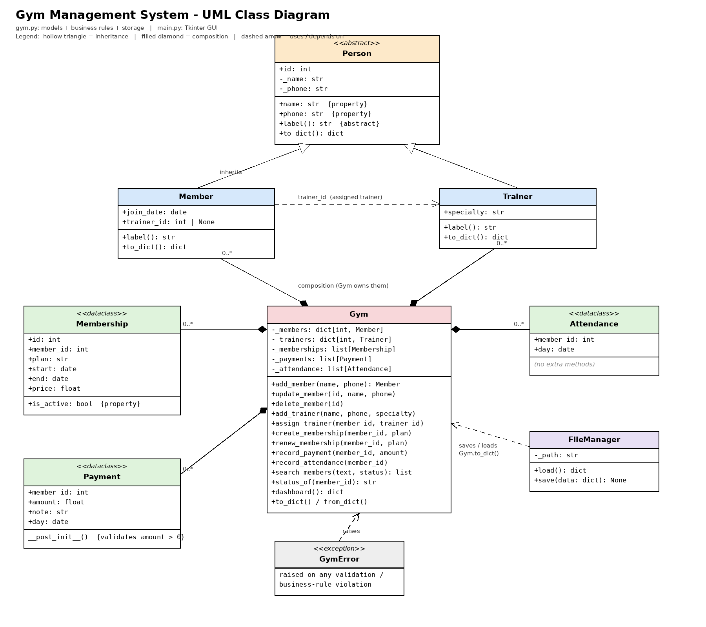

# Gym Management System

## Team Members
- Omar Ahmed Hamza Nomeir

## Project Description
A small desktop application for managing a gym: members, trainers, memberships, payments and
attendance. Built with Python and Object-Oriented Programming, with a Tkinter GUI (dark,
black + ember-orange gym theme) and JSON file storage (no database).

## Main Features
- Add / update / delete members
- Add trainers and assign a trainer to a member
- Create and renew memberships (Monthly / Quarterly / Yearly)
- Record payments (membership payments are recorded automatically) and attendance
- Search members (by ID, name or phone) and filter by status: Active / Expired / No Membership
- Dashboard with live numbers (members, trainers, active/expired memberships, revenue, today's attendance)

## Project Structure
```
gym_project2_v2/
├── main.py              # Tkinter GUI (run this file) — dark / orange gym theme
├── gym.py               # All classes: models, business rules and FileManager
├── data/gym.json        # Created automatically on first run
├── tests/
│   ├── test_scenarios.txt   # the documented test scenarios
│   └── test_gym.py          # automated version (pytest)
├── screenshots/          # GUI screenshots
├── uml_class_diagram.png
└── README.md
```

## Classes
| Class | Role |
|---|---|
| `Person` (abstract) | Base class: id, name, phone (validated) |
| `Member(Person)` | Gym member: join date, assigned trainer |
| `Trainer(Person)` | Trainer with a specialty |
| `Membership` (`@dataclass`) | Plan, start/end date, price, `is_active` |
| `Payment` (`@dataclass`) | Amount (validated > 0 in `__post_init__`), date, note |
| `Attendance` (`@dataclass`) | Member check-in with date |
| `Gym` | Main class: owns all objects and enforces business rules |
| `FileManager` | Loads/saves data to JSON |
| `GymError` | Custom exception for validation / rule violations |

## OOP Concepts Used
| Concept | Where |
|---|---|
| Classes & objects | All classes in `gym.py` |
| Constructors | `__init__` in `Person`, `Member`, `Trainer`, `Gym`, `FileManager`; `__post_init__` in the `@dataclass` classes |
| Encapsulation | Private `_name`, `_phone`, `_members`, `_trainers`... accessed through properties/methods |
| Properties | `Person.name`, `Person.phone`, `Membership.is_active`, `Gym.members`... |
| Inheritance | `Member` and `Trainer` inherit from `Person` |
| Polymorphism | `label()` is implemented differently in `Member` and `Trainer`; the GUI calls `label()` on any `Person` |
| Abstraction | `Person` is an abstract class (`ABC`) with abstract method `label()` |
| Composition | `Gym` contains Members, Trainers, Memberships, Payments and Attendance objects |
| Type hints | Used throughout the code |
| Exception handling | `GymError` raised in `gym.py` and shown as a message box in the GUI |

## Business Rules
1. A member cannot attend if their membership is expired (or they have none).
2. A member cannot have two active memberships.
3. Payment amount must be greater than zero.
4. A member must exist before attendance/payment/membership can be recorded.
5. Renewing an active membership extends it; renewing an expired one creates a new membership.

## File Storage
All data is saved to `data/gym.json` using JSON. It is loaded when the app starts, saved after every
change, and saved again when the window is closed. `FileManager` keeps file handling separate from business logic.

## GUI Framework & Design
Tkinter (comes with Python, nothing to install). The interface uses a dark, high-contrast
"black + ember orange" theme built for a gym brand: a header bar with a logo mark, pill-style
tabs, dark cards and tables, and an orange accent reserved for primary actions (Add, Create,
Record Payment, Check In) so the eye always knows what to click. Six tabs: Dashboard, Members,
Trainers, Memberships, Payments, Attendance. All styling lives in `main.py`; `gym.py` has no UI code.

## How to Run
```
python main.py
```
Requires Python 3.9+ (Tkinter is included on Windows/macOS; on Linux: `sudo apt install python3-tk`).

To run the automated tests: `pip install pytest` then `pytest tests`

## Test Scenarios
See `tests/test_scenarios.txt` (10 scenarios + 2 extra, all automated in `tests/test_gym.py`).

| # | Type | Scenario | Expected |
|---|---|---|---|
| 1 | Success | Add a member | Member added |
| 2 | Success | Create Monthly membership | Created + payment 300 |
| 3 | Success | Check-in with active membership | Attendance recorded |
| 4 | Invalid input | Empty name | "Name is required." |
| 5 | Invalid input | Phone with letters | "Phone must be 8-15 digits." |
| 6 | Invalid input | Invalid plan | "Please choose a valid plan." |
| 7 | Business rule | 2nd membership while one is active | Rejected |
| 8 | Business rule | Check-in with expired membership | Rejected |
| 9 | Edge case | Payment of 0 / negative | Rejected |
| 10 | Edge case | Delete member with records | All their records removed |

## UML Class Diagram


## Screenshots
| | |
|---|---|
|  |  |
|  |  |
|  |  |
